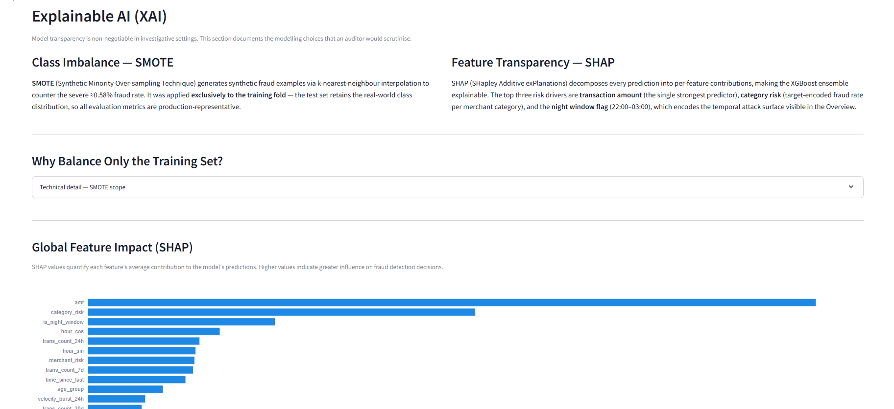
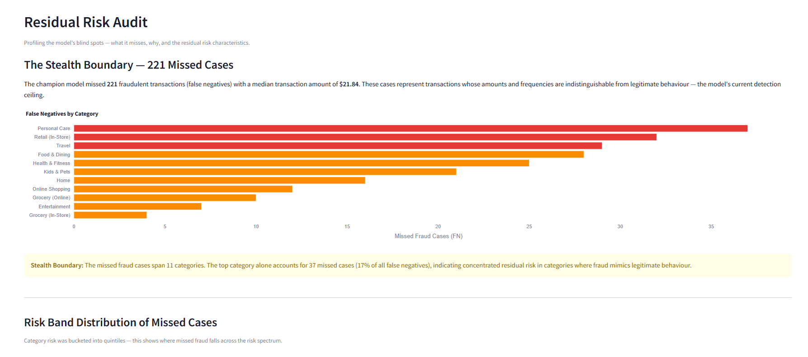

# Fraud Detection Pipeline & Investigator Dashboard

*End-to-end fraud detection system with behavioral feature engineering, XGBoost classification, SHAP explainability, and an interactive Streamlit dashboard.*

Python · Pandas · XGBoost · SHAP · SMOTE · Streamlit · Plotly

[▶ Live Demo](https://fraud-detection-dashboards.streamlit.app)

## Project Description

This project implements a complete fraud detection pipeline — from raw transaction data through behavioral feature engineering, model training and evaluation, to an interactive investigator-facing dashboard. It uses the Sparkov-generated synthetic dataset (Kartik2112, cited in Amazon's Fraud Dataset Benchmark), and all findings are treated as methodological demonstrations rather than real-world fraud insights. What distinguishes this pipeline is its domain-aware approach: recall-focused evaluation with cost-sensitive framing, 15 behavioral features built under a strict zero-leakage protocol, SHAP-based explainability at global and per-transaction levels, operational threshold analysis, and a purpose-built 4-view Streamlit dashboard designed as an investigator's tool. This is a portfolio demonstration of the full end-to-end workflow — not just model metrics in a notebook, but a working system that connects analysis to actionable tooling.

## Dashboard

| Overview | Transaction Auditor |
|----------|-------------------|
|  |  |

| Model Explainability | Residual Risk Audit |
|---------------------|-------------------|
|  |  |

The dashboard loads pre-computed predictions and metrics.

## Key Features

- **15 behavioral features** with zero-leakage protocol (expanding windows, shifted medians, rolling counts)
- **XGBoost + SMOTE** on a heavily imbalanced dataset (0.58% fraud rate, 1:172 ratio)
- **Recall-focused evaluation** with threshold sensitivity analysis across t=0.40–0.60
- **SHAP explainability** — global importance, directional beeswarm, and per-transaction waterfall decomposition
- **Geospatial neutrality audit** — separate notebook proving geographic features add no discriminatory signal
- **4-view interactive dashboard** — Overview, Transaction Auditor, Model Explainability, Residual Risk Audit
- **Residual risk profiling** — systematic audit of the 221 missed fraud cases, revealing the "stealth boundary" at low dollar amounts
- **Pre-computed dashboard data** — dashboard loads instantly from serialized JSON/CSV, no runtime inference

## Dataset

- **Name:** [Credit Card Transactions Fraud Detection Dataset](https://www.kaggle.com/datasets/kartik2112/fraud-detection) (Kartik2112)
- **Generator:** Sparkov (synthetic)
- **Scale:** ~1.3M training transactions, ~556K test transactions
- **Fraud rate:** 0.58% (1:172 imbalance)
- **Features:** Named fields including transaction amount, merchant, category, timestamps, cardholder demographics, and geolocation

> This is a synthetic dataset. All findings in this project are methodological demonstrations — they reflect how the pipeline handles fraud detection patterns, not real-world fraud behavior.

## Getting Started

### Dashboard Only (Quick Start)

```bash
git clone https://github.com/MachineheadLearning/fraud-forensics-pipeline.git
cd fraud-forensics-pipeline
pip install -r requirements.txt
streamlit run app/dashboard.py
```

Pre-computed data in `dashboard_data/` means you can explore the full dashboard without downloading the dataset or training any models.

### Full Reproduction

```bash
git clone https://github.com/MachineheadLearning/fraud-forensics-pipeline.git
cd fraud-forensics-pipeline
pip install -r requirements.txt
```

Download `fraudTrain.csv` and `fraudTest.csv` from the [Kaggle dataset page](https://www.kaggle.com/datasets/kartik2112/fraud-detection) and place them in `data/raw/`. Then run `analysis.ipynb` end-to-end — this regenerates all model artifacts in `models/` and dashboard data in `dashboard_data/`.

## Methodology

### Feature Engineering

The pipeline constructs 15 behavioral features designed to capture the signals an investigator would look for. The spending spike factor measures each transaction amount relative to the cardholder's expanding median, surfacing anomalous purchases against individual baselines. Velocity windows at 24-hour, 7-day, and 30-day horizons track transaction frequency, while the velocity burst ratio captures short-term acceleration against the monthly baseline — the kind of rapid-fire activity that characterizes card testing. A night window flag marks transactions between 22:00 and 03:00, the hours where 84% of fraud in this dataset concentrates. Category shift detection identifies first-time category usage after a cardholder has established purchase history, flagging behavioral pivots. All cardholder-level features follow a zero-leakage protocol: expanding windows use only prior transactions with shifted medians, and rolling velocity windows use `closed='left'` to strictly exclude the current transaction.

### Evaluation — Why Recall Matters

In fraud detection, missing a fraudulent transaction (false negative) is far costlier than flagging a legitimate one (false positive). A missed fraud case means financial loss and eroded trust; a false alarm costs only an analyst's time. This project evaluates using recall, precision, and the precision-recall curve rather than accuracy, which would be misleadingly high given the 0.58% fraud rate. The threshold analysis shows the concrete trade-off: lowering from t=0.50 to t=0.40 adds 768 alerts (+21%) but captures only 1.8% more fraud. The selected operating point (t=0.50) catches 89.7% of fraud at 52.7% precision — roughly 1 in 2 flagged transactions is confirmed fraud.

### Explainability

SHAP (SHapley Additive exPlanations) provides model transparency at three levels: global feature importance ranking, directional impact analysis via beeswarm plots, and per-transaction waterfall decompositions showing exactly why a specific transaction was flagged. This satisfies the "right to explanation" framework expected in financial services — every alert can be accompanied by a human-readable breakdown of its risk drivers.

## Project Structure

```
fraud-forensics-pipeline/
├── README.md
├── requirements.txt
├── .gitignore
├── data/
│   └── raw/                              # fraudTrain.csv, fraudTest.csv (gitignored)
├── dashboard_data/
│   ├── dashboard_stats.json              # Pre-computed KPIs, chart data, model metrics
│   └── investigative_results.csv         # Filtered transactions with risk scores
├── notebooks/
│   ├── analysis.ipynb                    # Full pipeline: EDA → features → model → export
│   └── geospatial_neutrality_report.ipynb
├── app/
│   └── dashboard.py                      # Streamlit dashboard (4 views)
├── models/                               # champion_model.joblib, scaler.joblib (gitignored)
└── screenshots/                          # Dashboard screenshots for README
```

## Limitations & Future Directions

### Limitations

The dataset is synthetic (Sparkov-generated), so the patterns are more deterministic than real adversarial fraud — models trained here should not inform real fraud decisions. The model's primary blind spot is low-dollar mimicry fraud ($21.84 median for missed cases) that blends into normal spending patterns, evading detection across all risk bands. Behavioral features require transaction history, creating a cold-start vulnerability for new accounts with no established baseline. The pipeline is batch-oriented with no real-time scoring capability, and uses a single model architecture without ensemble stacking or graph-based methods.

### Future Directions

Graph-link analysis could enable fraud ring detection by identifying shared device fingerprints, funding sources, or merchant clusters. An active learning feedback loop — where investigator adjudications on flagged transactions retrain the model — would tighten the precision-recall trade-off over successive deployment cycles. Temporal drift monitoring would detect concept drift as fraud tactics evolve, triggering retraining before model degradation reaches the alert queue.

## Author

**Miguel Buitrago** — [LinkedIn](https://www.linkedin.com/in/miguel-buitrago-ortiz-62774b270)

Built as a portfolio project demonstrating the end-to-end workflow from data exploration through model training to investigator-facing dashboard tooling. Claude Code was used as a development accelerator.
